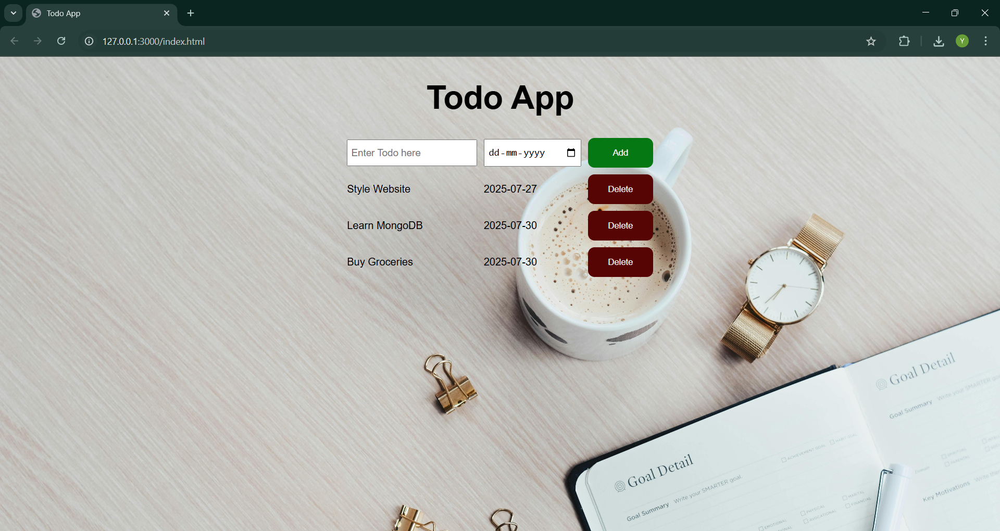

# 📝 To-Do List Website

A simple and responsive To-Do List web application built using **HTML**, **CSS**, and **JavaScript**. This project helps users manage their daily tasks efficiently by allowing them to add and delete tasks as completed.

## 🔧 Features

- ✅ Add new tasks easily  
- ❌ Delete tasks with a single click  

## 💻 Tech Stack

- **HTML** – Structure of the app  
- **CSS** – Styling and layout (includes responsive design)  
- **JavaScript** – Logic for task management and dynamic updates

## 🔗 Website Link
 https://imyashmehta.github.io/To-Do-App/

## 📸 Screenshot

