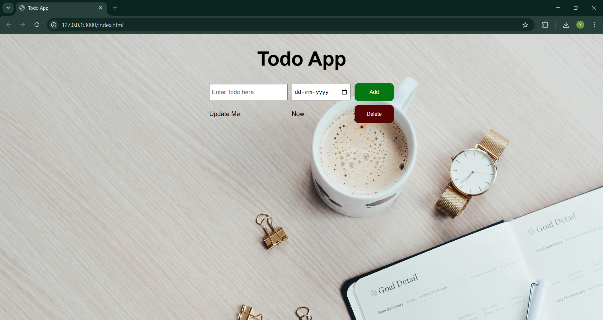

# 📝 To-Do List Website

A simple and responsive To-Do List web application built using **HTML**, **CSS**, and **JavaScript**. This project helps users manage their daily tasks efficiently by allowing them to add, delete, and mark tasks as completed. It demonstrates fundamental web development skills, including DOM manipulation, event handling, and local storage usage.

## 🔧 Features

- ✅ Add new tasks easily  
- ❌ Delete tasks with a single click  

## 💻 Tech Stack

- **HTML** – Structure of the app  
- **CSS** – Styling and layout (includes responsive design)  
- **JavaScript** – Logic for task management and dynamic updates

## 📸 Screenshot

